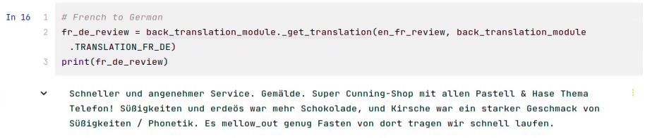

<h1 color="green" align="center">NLP Albumentations</h1>

<h2 color="blue" align="center">Augmentation Techniques & Results</h2>

 

### Abstract

NLP Albumentation is an area which focuses on using augmentation techniques to generate more high-quality data from a
given limited amount of data. The first ideas of augmentation came from the field of Computer Vision where to generate
more images, techniques such as translation, rotation, compression, or color adjustment in image's RGB channel were
used.

Since the internet comprises of mostly image data, using text augmentation techniques can alleviate the problem of 
scarcity of text data. Using various sources, these techniques can improve the performance of AI models that rely
heavily on large amounts of data. 

### Augmentation Techniques

<ol>

<li><b>Semantic exchange</b> is a technique proposed by 
<a href="#ref01">Feng et al., 2019 [1]</a>
in which the semantics of the text are adjusted while
preserving the text polarity as well as its fluency.</li>

<li><b>Keyword replacements</b> using synonyms and antonyms as described in
<a href="#ref02">Liu, Meng, 2020 [2]</a> changes the polarity of sentences
by flipping synonyms and antonyms.</li> 

<li><b>Back-translation</b> as described in <a href="#ref03">J Son, 2018 [3]</a> is one of the most widely used enhancement techniques in which a text
input is converted sequentially in various languages, and finally converted into the original language of the text.
The idea is to add noise due to the different grammatical structures of various languages, thus keeping the same
semantic meaning while altering the structure of the input text.</li>
</ol>

### Implementation Details and Results

The following shows three augmentation techniques that were used to generate new data.
  
<b>Original Review</b>

  
<b>A. Semantic Keyword Replacement</b> 

This technique replaces nouns or noun-phrases using the Universal Sentence Encoder (USE) as it has transformer model 
using deep averaging network <a href="#ref04">(Cer et al., 2018) [4]</a>.
  
<ol>
<li>The first step is to generate the parts of speech tags for all the words. Using the 
<a href="#ref05">Stanford Constituency Parser [5]</a>, I were able to fetch the tags for nouns and noun-phrases.</li> 

<li>For each noun or noun-phrase, I used the <a href="#ref06">Hugging Face’s pre-trained glove vectors [6]</a> to generate a potential
replacement entity for each word.</li> 

<li>For every potential replacement entity (RE), I used the USE model to find the best target word in 
the original text. The USE model uses the context of the word to find the potential targets.
I sequentially performed this step until all the REs are exhausted and that generates the first augmented sentence.</li> 
</ol>

  
<b>B. Synonym & Antonym Replacement </b> 

This technique replaces Verbs, Adjectives, and Adverbs in the input text by using WordNet from NLTK corpus.

<ol>
<li>The input sentence is processed to get Verbs, ADJ, and ADV parts of speech tags using
<a href="#ref05">Stanford Constituency Parser [5]</a>;
the list will be our potential replacement entity.</li>
<li>Using the WordNet model, for each potential replacement entity (RE), I use the word’s lemma to generate the synonyms list. </li>
<li>For each REs synonym list, I picked an item randomly and replace it in the input sentence. </li>
<li>The input sentence generates its synonym-augmented counterpart. </li>
<li>Similarly steps 1 to 3 are performed for antonym list of a replacement entity. This again generates an antonym-augmented counterpart of the input sentence.</li> 
</ol>

<i>Augmentation with Synonyms:</i>

<i>Augmentation with Antonyms:</i>

 
<b>C. Back-Translation</b> 

The idea of back-translation is to generate semantically similar, but different text. Using
<a href="#ref07">Hugging Face’s Helsinki Pre-Trained Multilingual Models [7]</a>. I used three language models: 
English, French and German.
 
<ol>
<li>First convert the text from English to French</li>
<li>Second, convert the text from step 1 to German</li>
<li>Finally, convert the text from step 2 back to English</li> 
</ol>

<b>* Note</b>: Note: The steps 1-3 are implemented within a single function, so the output is directly
in English. The following steps are shown for demonstration purposes only.

<i>English to French</i>

 

<i>French to German</i>

 

<i>German to English</i>

 

<i>Compare with back-translation's input</i>

 

<b>* Note</b>: The highlights on images are done manually. The code does not highlight the changed text.

### References

[1]. Steven Y. Feng, Aaron W. Li, and Jesse Hoey. 2019. Keep calm and switch on! Preserving sentiment and fluency in
semantic text exchange. In Proceedings of the 2019 Conference on Empirical Methods in Natural Language Processing and 
the 9th International Joint Conference on Natural Language Processing (EMNLP-IJCNLP), pages 2701–2711, Hong Kong, China.
Association for Computational Linguistics.

[2]. P. Liu, X. Wang, C. Xiang and W. Meng, &ldquo;A Survey of Text Data Augmentation&rdquo;,
2020 International Conference on Computer Communication and Network Security
(CCNS), 2020, pp. 191-195, doi: 10.1109/CCNS50731.2020.00049.

 [3]. Son, J. (2018). Back translation as a documentation tool. The International Journal of Translation
and Interpreting Research, 10(2), 89–100. https://search.informit.org/doi/10.3316/informit.864953916346703

[4]. Daniel Cer, Yinfei Yang, Sheng-yi Kong, Nan Hua, Nicole Limtiaco, Rhomni St. John, Noah Constant,
Mario Guajardo-Cespedes, Steve Yuan, Chris Tar, Brian Strope, and Ray Kurzweil. 2018. Universal sentence encoder for 
English. In Proceedings of the 2018 Conference on Empirical Methods in Natural Language Processing: System
Demonstrations, pages 169–174, Brussels, Belgium. Association for Computational Linguistics. 

[5]. "Constituency Parsing - CoreNLP." https://stanfordnlp.github.io/CoreNLP/parse.html, Accessed 27 Oct. 2022. 

[6]. &ldquo;Fse/Glove-Wiki-Gigaword-300 · Hugging Face.&rdquo; Huggingface.co, huggingface.co/fse/glove-wiki-gigaword-300. Accessed 27 Oct. 2022.

[7]. &ldquo;Helsinki-NLP (Language Technology Research Group at the University of Helsinki).&rdquo;
Huggingface.co, huggingface.co/Helsinki-NLP. Accessed 27 Oct. 2022.

